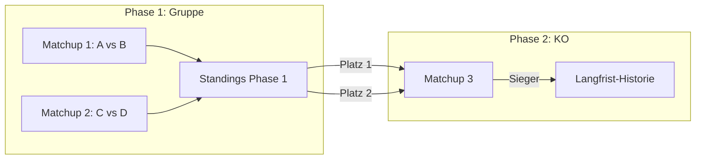

# Feature: Turniermodus mit dynamischen Matchups

## Zusammenfassung
Erweiterung der App von reinen Einzel-Gamedays zu einem flexiblen Turniermodus. Statt eine feste Turnierstruktur (Gruppen+KO, Winner/Loser-Bracket) fest zu programmieren, bekommt der Organisator ein generisches Werkzeug: er legt Matchups frei an, kann den Sieger eines Matchups automatisch als Teilnehmer eines Folge-Matchups verknüpfen ("Slot-Weiterleitung" statt fester Bracket-Engine), und die App berechnet automatisch eine einfache Punktetabelle aus abgeschlossenen Matchups. Ergebnisse werden dauerhaft gespeichert und über die Discord-Identität der Teilnehmer verknüpft, sodass langfristig Statistiken/Rankings über mehrere Turniere hinweg entstehen.

## Motivation / Problem
Die App wird aktuell zweckentfremdet für Turniere, obwohl sie nur für unabhängige Einzel-Gamedays (Round-Robin unter allen Anwesenden) gebaut wurde. Das Turnierformat ist innerhalb der Community nicht festgelegt und ändert sich vermutlich von Turnier zu Turnier (Gruppenphase+KO vs. Winner/Loser-Bracket, evtl. 2v2). Eine klassische Turniersoftware mit fest programmierter Bracket-Logik würde diese Flexibilität nicht abbilden und ist ohne klares Konzept ein zu großer, riskanter Aufwand. Stattdessen soll die App die bereits nützlichen Bausteine (Map-Veto-Koordination, Discord-Steuerung, Verknüpfung von Discord-Personen mit gesammelten Daten) beibehalten und um generische, formatunabhängige Matchup-Verwaltung + minimale Automatisierung erweitern.

## Zielgruppe
- **Organisator/Admin**: verwaltet Matchups zentral (laut User-Entscheidung keine dezentrale Selbstverwaltung durch Teilnehmer)
- **Turnierteilnehmer**: SC2-Discord-Community, identifiziert über Discord-Login (Epic #21)

## Scope

### MVP (Must-Have)
- Generisches Matchup-Datenmodell, nicht mehr fix an ein einzelnes Gameday gebunden, sondern Teil eines übergeordneten "Turniers"
- **Phasen**: Ein Turnier besteht aus einer oder mehreren Phasen (z.B. "Gruppenphase", "KO-Runde 1"), jede Phase hat eine eigene Punktetabelle/Standings
- **Konfigurierbare Punkteregeln pro Phase** (z.B. Punkte pro Sieg) — nötig, damit eine Gruppenphase überhaupt eine sinnvolle Rangliste erzeugt
- Organisator kann Matchups jederzeit frei anlegen (beliebige Teilnehmer-Zuordnung, kein erzwungenes Round-Robin)
- Ergebniserfassung pro Matchup (Sieger, ggf. Score) — fehlt aktuell komplett im Datenmodell (nur `active`-Flag vorhanden)
- Automatische Punktetabelle/Standings je Phase: aggregiert abgeschlossene Matchup-Ergebnisse zu einer Rangliste
- **Slot-Referenzen** bei Matchup-Erstellung, statt fester Namen:
  - fester Teilnehmer (Discord-Identität)
  - "Sieger/Verlierer von Matchup X" → automatisches Advancement in KO-Strukturen
  - "Platz N der Standings von Phase P" → nötig für den Übergang Gruppenphase → KO (siehe Validierung unten)
- Bestehende Map-Veto-Funktionalität bleibt pro Matchup nutzbar (heutiger `veto.tsx`-Flow)
- **Discord-basierte Turnier-Anmeldung**: Organisator startet ein Turnier per Slash-Command im Discord-Server; unter der Ankündigungsnachricht erscheint ein Button ("✅ Anmelden"), über den sich Teilnehmer registrieren. Anmeldung steht jedem Server-Mitglied offen (keine Rollenbeschränkung) und bleibt technisch immer offen — es gibt keinen expliziten Anmeldeschluss, der Organisator ignoriert schlicht späte Anmeldungen bei der Matchup-Zuordnung
- **Anmeldeliste-Ansicht im Frontend**: Der Organisator sieht die über Discord registrierten Teilnehmer in einer eigenen Übersicht und wählt daraus für die Matchup-Slot-Zuordnung, statt Namen per Freitext einzugeben
- Langfristige Spieler-Historie: Ergebnisse werden dauerhaft gespeichert und über die Discord-Identität (Epic #21) einem Spieler zugeordnet, nicht nur pro Event

### Erweiterungen (Nice-to-Have)
- 2v2-Unterstützung (Teams statt Einzelspieler als Matchup-Teilnehmer/Slot)
- Rankings-/Profilseite mit übergreifender Statistik pro Spieler

### Out-of-Scope
- Generische Turnier-Engine mit vorprogrammierten Formaten (Round-Robin-Gruppen-Generator, Winner/Loser-Bracket-Generator, Seeding-Algorithmen)
- Automatische Turnierplan-Erstellung basierend auf Teilnehmerzahl
- Tie-Break-Regeln für Punktegleichstand (bleibt vorerst manuelle Organisator-Entscheidung)
- Dezentrale Matchup-Verwaltung durch Teilnehmer selbst

## Technisches Konzept

### Betroffene Bereiche
- `apps/api/src/models/gameday.ts`, `apps/api/src/routes/gamedays.ts` — Modell von "Gameday" (Liste von Matchups, `{player1, player2, active}`) zu "Tournament" (Matchups mit Slot-Referenzen + Ergebnis) erweitern
- `packages/shared/src/types.ts` — `Matchup`-Typ um `result`/`winner` und Slot-Referenz-Konzept erweitern (statt fixer `player1`/`player2`-Strings ein Slot = fester Name **oder** Verweis auf Sieger/Verlierer eines anderen Matchups oder Platz einer Phasen-Tabelle)
- `apps/website/src/lib/matchups.ts` — bestehender Round-Robin-Generator (`generateMatchups`) bleibt als optionaler Vorschlag, wird aber nicht mehr der einzige Weg, Matchups zu erzeugen
- `apps/website/src/routes/pairing.tsx`, `veto.tsx`, `matchup.tsx` — UI um manuelles Anlegen/Bearbeiten von Matchups sowie Ergebniserfassung erweitern
- Neue Route/Komponente für Standings-Tabelle
- `apps/bot/src/index.ts` — neuer Slash-Command "Turnier starten" + Button-Component-Interaction für die Anmeldung
- Abhängig von Epic #21 (#26–#28): Backend-Persistenz und Discord-Login müssen stehen, bevor turnierübergreifende Historie sinnvoll ist

### Architektur
Kernidee: Ein Matchup hat zwei Teilnehmer-Slots. Ein Slot ist entweder (a) ein fester, registrierter Teilnehmer (Discord-Identität), (b) ein Verweis "Sieger/Verlierer von Matchup Y", oder (c) ein Verweis "Platz N der Standings-Tabelle von Phase P". Beim Abschließen eines Matchups bzw. beim Update einer Phasen-Tabelle werden alle Slots, die darauf verweisen, automatisch aufgelöst. Damit lässt sich jede Bracket-Form (Winner/Loser, KO, Gruppenphase→KO) durch den Organisator frei zusammenstellen, ohne dass die App eine Turnierlogik selbst "versteht" — sie kennt nur Matchups, Phasen, Slots und Verweise.

**Discord-Anmeldung (Button statt Reaktion):** Der Organisator startet das Turnier per Slash-Command; der Bot postet eine Ankündigung mit einem Button-Component. Klicks darauf sind Discord-Component-Interactions und laufen über den bereits vorhandenen HTTP-Interactions-Endpoint (`apps/bot/src/index.ts`) — anders als Emoji-Reaktionen, die eine dauerhafte Gateway/WebSocket-Verbindung erfordern würden. Dadurch bleibt die bestehende Bot-Architektur (reiner Interactions-Webhook, kein Gateway) unverändert.

### Validierung: Bildet die Struktur auch klassische Turnierformate ab?
Ja — die Matchup/Slot/Phase-Relationen sind generisch genug, um die gängigen Formate als Daten abzubilden, ohne dass die App ein Format selbst kennt:
- **Round-Robin-Gruppe**: eine Phase, deren Matchups alle feste Teilnehmer-Slots haben (der bestehende Generator `generateMatchups()` kann eine Phase optional vorbefüllen); Standings ergeben sich automatisch aus den Punkteregeln der Phase.
- **Single-Elimination (KO)**: jede Runde ist eine Phase (oder Teil einer Phase), spätere Matchups referenzieren "Sieger von Matchup X" — entspricht der MVP-Slot-Referenz.
- **Double-Elimination (Winner/Loser-Bracket)**: identisch zu Single-Elimination, nutzt zusätzlich "Verlierer von Matchup X" als Slot-Referenz in einer parallelen Loser-Bracket-Phase — keine neue Relation nötig.
- **Gruppenphase → KO (aktuell in der Community diskutiert)**: benötigt die dritte Slot-Referenz "Platz N der Standings von Phase P" — das ist der einzige zusätzliche Baustein gegenüber der ursprünglichen Idee und wurde deshalb in die MVP-Slot-Referenzen aufgenommen.
- **Grenze**: Was die App weiterhin nicht selbst tut, ist Formate automatisch generieren (z.B. "erstelle mir ein 8er-KO aus diesen Teilnehmern") — das bleibt manuelle Organisator-Arbeit. Diese Grenze ist bewusst so gewählt (siehe Out-of-Scope), lässt sich aber ohne Datenmodell-Änderung später als reine Komfort-Funktion ergänzen, falls gewünscht.

### Abhängigkeiten
- Baut auf Epic #21 auf (#26 Persistenz, #28 Frontend-API-Anbindung) — ohne diese keine sinnvolle turnierübergreifende Historie
- Ergänzt #29 (Bot erstellt Gamedays) — müsste um Turnier-Bezug und Button-Interaction-Handling erweitert werden
- Keine neuen externen Pakete erwartet (Slot-Referenzen sind reine Datenmodellierung; Button-Interactions nutzen die bereits vorhandene Discord-Interactions-Verarbeitung)

### Risiken
- Datenmodell-Migration: bestehende Matchups (`player1`/`player2` als reine Strings, keine IDs) müssten auf Discord-identifizierte Spieler umgestellt werden — Kollisionsrisiko bei Namensgleichheit
- Scope-Kriechen: Versuchung, doch automatische Format-Generatoren (Bracket-/Gruppen-Generator) einzubauen, sobald die Slot-Referenz-Logik steht — bewusst dagegenhalten (siehe Out-of-Scope)
- 2v2-Unterstützung verkompliziert das Slot-Modell (Slot referenziert dann ein Team, nicht einen Spieler) — daher bewusst als Erweiterung, nicht MVP
- Anmeldeliste vs. Matchup-Zuordnung: die Zuordnung von Discord-Anmeldungen zu Matchup-Slots ist manuell durch den Organisator — bei großen Turnieren ggf. UX-Aufwand in der Organisator-Oberfläche

## Offene Fragen
Keine — alle im Discovery-Prozess aufgeworfenen Fragen sind geklärt (Tie-Break bleibt manuell/Out-of-Scope, 2v2 bleibt bewusst Nice-to-Have ohne Schema-Vorbereitung, Anmeldung offen für alle Server-Mitglieder ohne Anmeldeschluss).
