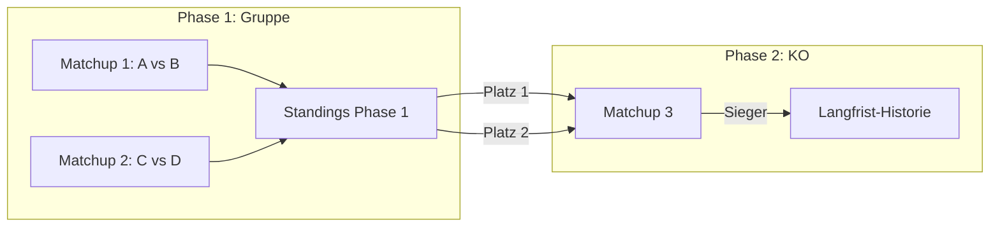

# Feature: Turniermodus mit dynamischen Matchups

## Zusammenfassung
Erweiterung der App von reinen Einzel-Gamedays zu einem flexiblen Turniermodus. Statt eine feste Turnierstruktur (Gruppen+KO, Winner/Loser-Bracket) fest zu programmieren, bekommt der Organisator ein generisches Werkzeug: er legt Matchups frei an, kann den Sieger eines Matchups automatisch als Teilnehmer eines Folge-Matchups verknüpfen ("Slot-Weiterleitung" statt fester Bracket-Engine), und die App berechnet automatisch eine einfache Punktetabelle aus abgeschlossenen Matchups. Ergebnisse werden dauerhaft gespeichert und über die Discord-Identität der Teilnehmer verknüpft, sodass langfristig Statistiken/Rankings über mehrere Turniere hinweg entstehen.

## Motivation / Problem
Die App wird aktuell zweckentfremdet für Turniere, obwohl sie nur für unabhängige Einzel-Gamedays (Round-Robin unter allen Anwesenden) gebaut wurde. Das Turnierformat ist innerhalb der Community nicht festgelegt und ändert sich vermutlich von Turnier zu Turnier (Gruppenphase+KO vs. Winner/Loser-Bracket, evtl. 2v2). Eine klassische Turniersoftware mit fest programmierter Bracket-Logik würde diese Flexibilität nicht abbilden und ist ohne klares Konzept ein zu großer, riskanter Aufwand. Stattdessen soll die App die bereits nützlichen Bausteine (Map-Veto-Koordination, Discord-Steuerung, Verknüpfung von Discord-Personen mit gesammelten Daten) beibehalten und um generische, formatunabhängige Matchup-Verwaltung + minimale Automatisierung erweitern.

## Zielgruppe
- **Organisator/Admin**: verwaltet Matchups zentral (laut User-Entscheidung keine dezentrale Selbstverwaltung durch Teilnehmer). Organisator eines Turniers ist, wer es erstellt hat (Owner-Modell, siehe Autorisierung)
- **Turnierteilnehmer**: SC2-Discord-Community, identifiziert über Discord-Login (Epic #21)

## Scope

### MVP (Must-Have)
- Generisches Matchup-Datenmodell, nicht mehr fix an ein einzelnes Gameday gebunden, sondern Teil eines übergeordneten "Turniers"
- **Phasen**: Ein Turnier besteht aus einer oder mehreren Phasen (z.B. "Gruppenphase", "KO-Runde 1"), jede Phase hat eine eigene Punktetabelle/Standings und einen Status (`offen` → `abgeschlossen`)
- **Expliziter Phasen-Abschluss**: Solange eine Phase `offen` ist, aktualisieren sich ihre Standings live, gelten aber als vorläufig. Der Organisator schließt die Phase aktiv ab ("Phase beenden"); erst dann werden "Platz N der Standings"-Slots aufgelöst und die Phase ist gegen weitere Ergebnisänderungen gesperrt (spätere Korrektur nur über den bewussten Korrektur-Flow mit Warnung, siehe Referenz-Integrität)
- **Konfigurierbare Punkteregeln pro Phase** (z.B. Punkte pro Sieg) — nötig, damit eine Gruppenphase überhaupt eine sinnvolle Rangliste erzeugt
- Organisator kann Matchups jederzeit frei anlegen (beliebige Teilnehmer-Zuordnung, kein erzwungenes Round-Robin)
- Ergebniserfassung pro Matchup (Sieger, ggf. Score) — fehlt aktuell komplett im Datenmodell (nur `active`-Flag vorhanden)
- Automatische Punktetabelle/Standings je Phase: aggregiert abgeschlossene Matchup-Ergebnisse zu einer Rangliste
- **Slot-Referenzen** bei Matchup-Erstellung, statt fester Namen:
  - fester Teilnehmer (Discord-Identität)
  - "Sieger/Verlierer von Matchup X" → automatisches Advancement in KO-Strukturen
  - "Platz N der Standings von Phase P" → nötig für den Übergang Gruppenphase → KO (siehe Validierung unten). **Auflösung nur bei eindeutiger Reihenfolge**: Ist Platz N durch Punktegleichstand nicht eindeutig bestimmbar, löst die App den Slot **nicht** automatisch auf, sondern markiert ihn als "ungeklärt" und der Organisator setzt den Teilnehmer manuell (siehe Tie-Break unten)
- Bestehende Map-Veto-Funktionalität bleibt pro Matchup nutzbar (heutiger `veto.tsx`-Flow)
- **Discord-basierte Turnier-Anmeldung**: Organisator startet ein Turnier per Slash-Command im Discord-Server; unter der Ankündigungsnachricht erscheint ein Button ("✅ Anmelden"), über den sich Teilnehmer registrieren. Anmeldung steht jedem Server-Mitglied offen (keine Rollenbeschränkung) und bleibt technisch immer offen — es gibt keinen expliziten Anmeldeschluss, der Organisator ignoriert schlicht späte Anmeldungen bei der Matchup-Zuordnung
- **Anmeldeliste-Ansicht im Frontend**: Der Organisator sieht die über Discord registrierten Teilnehmer in einer eigenen Übersicht und wählt daraus für die Matchup-Slot-Zuordnung, statt Namen per Freitext einzugeben
- Langfristige Spieler-Historie: Ergebnisse werden dauerhaft gespeichert und über die Discord-Identität (Epic #21) einem Spieler zugeordnet, nicht nur pro Event
- **Autorisierung (Owner-Modell)**: Jedes Turnier hat einen Owner — den Discord-User, der es erstellt hat. Nur der Owner darf Matchups anlegen/ändern, Ergebnisse eintragen und "ungeklärte" Slots fixieren. Alle anderen (auch angemeldete Teilnehmer) haben Lesezugriff. Die heutige JWT-Middleware (schützt nur "eingeloggt vs. nicht") reicht dafür nicht — es braucht eine zusätzliche Owner-Prüfung auf den turnierverändernden Routes

### Erweiterungen (Nice-to-Have)
- 2v2-Unterstützung (Teams statt Einzelspieler als Matchup-Teilnehmer/Slot)
- Rankings-/Profilseite mit übergreifender Statistik pro Spieler
- Co-Organisatoren und/oder serverweite Admin-Rolle als Verwaltungs-Override (über das MVP-Owner-Modell hinaus)

### Out-of-Scope
- Generische Turnier-Engine mit vorprogrammierten Formaten (Round-Robin-Gruppen-Generator, Winner/Loser-Bracket-Generator, Seeding-Algorithmen)
- Automatische Turnierplan-Erstellung basierend auf Teilnehmerzahl
- Automatische Tie-Break-Regeln für Punktegleichstand (direkter Vergleich, Buchholz o.ä.) — bleibt vorerst manuelle Organisator-Entscheidung. **Konsequenz für die Slot-Auflösung:** Bei Gleichstand um einen qualifikationsrelevanten Platz kann die App "Platz N" nicht deterministisch auflösen; sie markiert den betroffenen Slot dann als "ungeklärt" und überlässt die Zuordnung dem Organisator, statt einen Algorithmus zu erzwingen (siehe Tie-Break-Abschnitt in der Architektur)
- Dezentrale Matchup-Verwaltung durch Teilnehmer selbst

## Technisches Konzept

### Betroffene Bereiche
- `apps/api/src/models/gameday.ts`, `apps/api/src/routes/gamedays.ts` — Modell von "Gameday" (Liste von Matchups, `{player1, player2, active}`) zu "Tournament" (Matchups mit Slot-Referenzen + Ergebnis) erweitern; Turnier bekommt ein `ownerId`-Feld (Discord-ID des Erstellers)
- Autorisierungs-Middleware — zusätzlich zur bestehenden JWT-Prüfung eine Owner-Prüfung auf turnierverändernden Routes (nur Owner darf schreiben; `403` sonst)
- `packages/shared/src/types.ts` — `Matchup`-Typ um `result`/`winner` und Slot-Referenz-Konzept erweitern (statt fixer `player1`/`player2`-Strings ein Slot = fester Name **oder** Verweis auf Sieger/Verlierer eines anderen Matchups oder Platz einer Phasen-Tabelle)
- `apps/website/src/lib/matchups.ts` — bestehender Round-Robin-Generator (`generateMatchups`) bleibt als optionaler Vorschlag, wird aber nicht mehr der einzige Weg, Matchups zu erzeugen
- `apps/website/src/routes/pairing.tsx`, `veto.tsx`, `matchup.tsx` — UI um manuelles Anlegen/Bearbeiten von Matchups sowie Ergebniserfassung erweitern
- Neue Route/Komponente für Standings-Tabelle
- `apps/bot/src/index.ts` — neuer Slash-Command "Turnier starten" + Button-Component-Interaction für die Anmeldung; Button trägt die Turnier-ID in der `custom_id`, antwortet deferred und ruft die API per Service-Token auf (neue Bot→API-Abhängigkeit, neuer Config-Wert für Token/API-URL)
- `apps/api/src/routes/` — neue Route für Anmeldungen (z.B. `POST /api/tournaments/:id/registrations`), authentifiziert für den Bot per Service-Token; dedupliziert Anmeldungen pro Discord-ID/Turnier
- Abhängig von Epic #21 (#26–#28): Backend-Persistenz und Discord-Login müssen stehen, bevor turnierübergreifende Historie sinnvoll ist

### Autorisierung (Owner-Modell)
Ein Turnier speichert seinen Owner (die Discord-ID des Erstellers). Turnierverändernde API-Routes (Matchups anlegen/ändern, Ergebnisse, Slot-Fixierung, Phasen) prüfen zusätzlich zur bestehenden JWT-Middleware, dass der eingeloggte User der Owner des betroffenen Turniers ist; sonst `403`. Lesezugriff (Standings, Matchups, Anmeldeliste ansehen) bleibt für alle eingeloggten User offen.

- Der Owner wird beim Erstellen gesetzt — sowohl beim Start per Discord-Slash-Command (Discord-ID des Aufrufers) als auch bei einer späteren reinen Web-Erstellung (Discord-ID aus dem JWT).
- Co-Organisatoren / eine serverweite Admin-Rolle als Override sind bewusst **nicht** im MVP, aber vorgesehen als spätere Erweiterung (zusätzliche Owner-Liste bzw. Rollen-Check) — das Datenmodell (Owner-Feld) sollte das nicht verbauen.

### Architektur
Kernidee: Ein Matchup hat zwei Teilnehmer-Slots. Ein Slot ist entweder (a) ein fester, registrierter Teilnehmer (Discord-Identität), (b) ein Verweis "Sieger/Verlierer von Matchup Y", oder (c) ein Verweis "Platz N der Standings-Tabelle von Phase P". Beim Abschließen eines Matchups bzw. beim Update einer Phasen-Tabelle werden alle Slots, die darauf verweisen, automatisch aufgelöst. Damit lässt sich jede Bracket-Form (Winner/Loser, KO, Gruppenphase→KO) durch den Organisator frei zusammenstellen, ohne dass die App eine Turnierlogik selbst "versteht" — sie kennt nur Matchups, Phasen, Slots und Verweise.

**Discord-Anmeldung (Button statt Reaktion):** Der Organisator startet das Turnier per Slash-Command; der Bot postet eine Ankündigung mit einem Button-Component. Klicks darauf sind Discord-Component-Interactions und laufen über den bereits vorhandenen HTTP-Interactions-Endpoint (`apps/bot/src/index.ts`) — anders als Emoji-Reaktionen, die eine dauerhafte Gateway/WebSocket-Verbindung erfordern würden. Das **Interaktionsmodell** (reiner Interactions-Webhook, kein Gateway) bleibt damit erhalten.

Was sich dagegen **ändert**: Der Bot muss die Anmeldung persistieren, hat aber heute bewusst keine Daten-Anbindung. Er bekommt daher einen **Server-zu-Server-Call an die bestehende API** (z.B. `POST /api/tournaments/:id/registrations`, authentifiziert per Service-Token), statt selbst eine DB-Verbindung zu öffnen. So bleibt die DB der einzige Datenzugriffspunkt in der API; der Bot bleibt DB-frei, bekommt aber erstmals eine Abhängigkeit zur API (neuer Service-Token in der Bot-Config, API-Route + Auth für den Bot). Diese Erweiterung ist real und darf nicht als "keine Änderung" verbucht werden.

Ablauf eines Button-Klicks:
- **Zuordnung:** Die `custom_id` des Buttons trägt die Turnier-ID (z.B. `register:<tournamentId>`), damit der zustandslose Bot weiß, für welches Turnier die Anmeldung gilt — er hält selbst keinen Mapping-Zustand.
- **3-Sekunden-Deadline:** Der Bot antwortet sofort mit einer **deferred response** (ACK), führt danach den API-Call aus und reicht das Ergebnis (angemeldet / bereits angemeldet / Fehler) als Follow-up nach. Damit bleibt die Interaktion robust, auch wenn API + SurrealDB (Kaltstart/Latenz) die 3 s überschreiten würden.
- **Idempotenz & Abmeldung:** Mehrfaches Klicken meldet nicht doppelt an (die API dedupliziert über die Discord-ID pro Turnier). Ob ein erneuter Klick eine **Abmeldung** auslöst (Toggle) oder ein separater Button dafür nötig ist, ist eine kleine offene UX-Entscheidung (siehe Offene Fragen).

### Validierung: Bildet die Struktur auch klassische Turnierformate ab?
Ja — die Matchup/Slot/Phase-Relationen sind generisch genug, um die gängigen Formate als Daten abzubilden, ohne dass die App ein Format selbst kennt:
- **Round-Robin-Gruppe**: eine Phase, deren Matchups alle feste Teilnehmer-Slots haben (der bestehende Generator `generateMatchups()` kann eine Phase optional vorbefüllen); Standings ergeben sich automatisch aus den Punkteregeln der Phase.
- **Single-Elimination (KO)**: jede Runde ist eine Phase (oder Teil einer Phase), spätere Matchups referenzieren "Sieger von Matchup X" — entspricht der MVP-Slot-Referenz.
- **Double-Elimination (Winner/Loser-Bracket)**: identisch zu Single-Elimination, nutzt zusätzlich "Verlierer von Matchup X" als Slot-Referenz in einer parallelen Loser-Bracket-Phase — keine neue Relation nötig.
- **Gruppenphase → KO (aktuell in der Community diskutiert)**: benötigt die dritte Slot-Referenz "Platz N der Standings von Phase P" — das ist der einzige zusätzliche Baustein gegenüber der ursprünglichen Idee und wurde deshalb in die MVP-Slot-Referenzen aufgenommen. **Grenze bei Punktegleichstand:** Ist Platz N durch Gleichstand nicht eindeutig (klassisch genau an der Qualifikationsgrenze), ist die automatische Auflösung bewusst ausgesetzt — der Slot bleibt "ungeklärt", bis der Organisator ihn manuell setzt (siehe Tie-Break unten). Damit bleibt das Kernversprechen (Automatik, wenn eindeutig) erhalten, ohne einen nicht spezifizierten Tie-Break-Algorithmus vorauszusetzen.

### Tie-Break / nicht eindeutige Standings
Standings werden aus den Phasen-Punkteregeln automatisch sortiert. Ein automatischer Tie-Break bei Punktegleichstand ist bewusst Out-of-Scope. Konsequenz für Slot-Referenzen vom Typ "Platz N der Standings von Phase P":
- Ist Platz N **eindeutig** (keine Punktgleichheit an der relevanten Grenze), löst die App den Slot automatisch auf.
- Ist Platz N **nicht eindeutig**, bleibt der Slot im Status "ungeklärt": das abhängige Matchup ist noch nicht startbar, die betroffenen Standings-Plätze werden in der UI als gleichstandsbehaftet markiert, und der Organisator wählt den Teilnehmer manuell aus der Anmeldeliste bzw. den betroffenen Spielern. Erst nach dieser manuellen Zuordnung gilt der Slot als aufgelöst.
- Es wird **kein** Zweitkriterium (direkter Vergleich, Buchholz, Registrierungsreihenfolge o.ä.) automatisch angewandt — die Entscheidung liegt bewusst beim Organisator, damit die App keine Turnierregel-Semantik "kennt".

### Phasen-Status & Abschluss
Eine Phase hat einen Status `offen` → `abgeschlossen`. Der Abschluss ist ein bewusster Organisator-Schritt, kein Automatismus:
- Solange `offen`: Standings werden aus den vorliegenden Ergebnissen live berechnet, sind aber **vorläufig**. "Platz N der Standings von Phase P"-Slots, die auf diese Phase zeigen, bleiben **unaufgelöst** und die davon abhängigen Matchups sind nicht startbar.
- Beim Abschluss (`offen` → `abgeschlossen`): Die Standings werden festgeschrieben, alle darauf verweisenden "Platz N"-Slots werden aufgelöst (bzw. bei Punktegleichstand als "ungeklärt" markiert, siehe Tie-Break). Die Phase ist danach gegen normale Ergebniseingaben gesperrt.
- Nachträgliche Änderung an einer abgeschlossenen Phase ist nur über den expliziten Korrektur-Flow möglich und löst die Warn-Logik für abhängige Matchups aus (siehe Referenz-Integrität & Ergebnis-Korrektur).
- Ob der Abschluss erst möglich ist, wenn alle Matchups der Phase ein Ergebnis haben, ist eine kleine UX-Frage (Warnung bei unvollständiger Phase vs. Hard-Block) — Vorschlag: warnen, aber zulassen, damit der Organisator flexibel bleibt.

### Referenz-Integrität & Ergebnis-Korrektur
Weil der Organisator Matchups und Slot-Referenzen frei anlegt, braucht das generische Modell klare Integritätsregeln — sonst entstehen Zyklen, tote Verweise oder inkonsistente Brackets nach einer Korrektur.

- **Zyklen-Prüfung:** Beim Anlegen/Ändern einer Slot-Referenz validiert die App, dass kein Matchup direkt oder transitiv auf sich selbst verweist (A → Sieger von B, B → Sieger von A). Ein solcher Verweis wird abgelehnt.
- **Existenz-Prüfung (keine Dangling References):** Eine Slot-Referenz muss auf ein existierendes Matchup bzw. eine existierende Phase zeigen. Das Löschen eines Matchups/einer Phase, auf das/die noch verwiesen wird, wird blockiert (mit Hinweis auf die abhängigen Slots) — erst die Referenz auflösen/umhängen, dann löschen.
- **Ergebnis-Korrektur (Warnen statt automatisch kaskadieren):** Wird der Sieger/Score eines bereits abgeschlossenen Matchups nachträglich geändert, verwirft die App **nicht** automatisch abhängige Ergebnisse. Stattdessen ermittelt sie alle transitiv abhängigen Slots/Matchups und zeigt dem Organisator, welche davon betroffen sind:
  - Betroffene Slots, deren Folge-Matchup noch **kein** Ergebnis hat, kann der Organisator mit einem Klick neu auflösen lassen.
  - Betroffene Folge-Matchups, die **bereits ein Ergebnis** haben, werden nur markiert (potenziell inkonsistent) — ob und was zurückgesetzt wird, entscheidet der Organisator manuell. Es gehen keine gespielten Ergebnisse ohne ausdrückliche Aktion verloren.
- Diese Regeln sind reine Daten-/Konsistenzlogik und ändern nichts am Grundsatz, dass die App kein Turnierformat "versteht".
- **Grenze**: Was die App weiterhin nicht selbst tut, ist Formate automatisch generieren (z.B. "erstelle mir ein 8er-KO aus diesen Teilnehmern") — das bleibt manuelle Organisator-Arbeit. Diese Grenze ist bewusst so gewählt (siehe Out-of-Scope), lässt sich aber ohne Datenmodell-Änderung später als reine Komfort-Funktion ergänzen, falls gewünscht.

### Abhängigkeiten
- **Gemeinsames Fundament (`shared-foundation.md`)**: Das Matchup-Ergebnis-Feld (`winner`/`score`) und der generische SSE-Live-Update-Kanal sind als vorgelagertes, geteiltes Fundament definiert, das sich Turniermodus und Replay-Upload teilen. Der Turniermodus ist der Ort, an dem das Ergebnis-Feld zuerst entsteht — beim Ergebnis-/Standings-Modell auf dieses Dokument abstimmen, damit kein zweites Ergebnis- oder Live-Update-Konzept entsteht
- Baut auf Epic #21 auf (#26 Persistenz, #28 Frontend-API-Anbindung) — ohne diese keine sinnvolle turnierübergreifende Historie
- Ergänzt #29 (Bot erstellt Gamedays) — müsste um Turnier-Bezug und Button-Interaction-Handling erweitert werden
- Keine neuen externen Pakete erwartet (Slot-Referenzen sind reine Datenmodellierung; Button-Interactions nutzen die bereits vorhandene Discord-Interactions-Verarbeitung)
- **Neu: Bot→API-Kopplung.** Der Bot bekommt erstmals eine Abhängigkeit zur API (Service-Token, API-URL in der Bot-Config) und eine authentifizierte Anmelde-Route auf API-Seite. Kein neues Paket, aber eine neue Service-Beziehung inkl. Auth zwischen Bot und API

### Risiken
- Datenmodell-Umstellung (Clean Break): Das Turniermodell löst das bestehende Gameday-Modell ab; bestehende Gameday-Records (`player1`/`player2` als reine Strings, keine IDs, kein Ergebnis) werden **nicht migriert**, sondern verworfen. Bewusste Entscheidung — vertretbar, weil noch keine erhaltenswerten Produktivdaten existieren. Konsequenz: keine Rückwärtskompatibilität zum alten Modell; die alte URL-Query-basierte Gameday-Erstellung (Spieler als Freitext im Bot, `?players=`) entfällt bzw. wird durch die anmeldebasierte Zuordnung ersetzt. Das Namensgleichheits-Risiko entfällt damit, weil künftig durchgängig Discord-identifizierte Spieler genutzt werden
- Scope-Kriechen: Versuchung, doch automatische Format-Generatoren (Bracket-/Gruppen-Generator) einzubauen, sobald die Slot-Referenz-Logik steht — bewusst dagegenhalten (siehe Out-of-Scope)
- Referenz-Integrität: Freies Anlegen von Slot-Referenzen erlaubt prinzipiell Zyklen, tote Verweise und Inkonsistenzen nach Ergebnis-Korrekturen. Gegenmaßnahmen (Zyklen-/Existenzprüfung, Warnung-statt-Auto-Kaskade bei Korrekturen) sind im Konzept festgelegt (siehe "Referenz-Integrität & Ergebnis-Korrektur"), müssen aber konsequent in der API durchgesetzt werden, nicht nur im Frontend
- 2v2-Unterstützung verkompliziert das Slot-Modell (Slot referenziert dann ein Team, nicht einen Spieler) — daher bewusst als Erweiterung, nicht MVP
- Anmeldeliste vs. Matchup-Zuordnung: die Zuordnung von Discord-Anmeldungen zu Matchup-Slots ist manuell durch den Organisator — bei großen Turnieren ggf. UX-Aufwand in der Organisator-Oberfläche
- Neue Bot→API-Kopplung: Bot und API sind künftig zur Anmeldezeit voneinander abhängig. Fällt die API aus, schlägt die Anmeldung fehl (durch deferred response immerhin sauber abfangbar mit Fehler-Follow-up). Service-Token muss sicher verwaltet werden (Bot-Config), damit die Anmelde-Route nicht offen im Netz steht

## Offene Fragen
Weitgehend geklärt (automatischer Tie-Break bleibt Out-of-Scope; bei nicht eindeutigem "Platz N" fixiert der Organisator den Slot manuell statt eines Algorithmus, 2v2 bleibt bewusst Nice-to-Have ohne Schema-Vorbereitung, Anmeldung offen für alle Server-Mitglieder ohne Anmeldeschluss). Verbleibende kleine Entscheidung:
- **Abmeldung per Button:** Löst ein erneuter Klick auf den Anmelden-Button eine Abmeldung aus (Toggle) oder braucht es einen separaten Button? Reine UX-Frage, kein Einfluss aufs Datenmodell.
