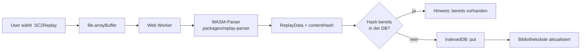

# Feature: Persönliche Replay-Bibliothek (lokal im Browser)

> Abgeleitet aus [`replay-upload.md`](./replay-upload.md). Dieses Konzept ersetzt für die
> aktuelle Umsetzung den dort beschriebenen Organisator-/Server-Flow durch einen rein
> clientseitigen User-Flow. Der Server-Flow bleibt als spätere Ausbaustufe bestehen und
> wird hier **nicht** verworfen, sondern nur zurückgestellt.

## Zusammenfassung
User laden ihre SC2-Replay-Dateien auf der ONOG-Website hoch und bekommen die darin
enthaltenen Spieldaten (Spieler, Rassen, Map, Spieldauer, Zeitpunkt und — sofern ableitbar —
den Sieger) ausgelesen. **Der gesamte Vorgang läuft im Browser des Users**: Die Datei wird per
WASM-Parser lokal analysiert, das Ergebnis landet in der **IndexedDB** des Users und bleibt
dort. Es gibt kein Backend, keine Datenbank, keinen Upload — die Datei verlässt das Gerät nie.
Damit entsteht eine persönliche, wachsende Replay-Bibliothek, die der User selbst besitzt.
Eine spätere Synchronisierung mit dem Backend (und die Verknüpfung mit Matchups) ist bewusst
vorbereitet, aber ausdrücklich nicht Teil dieses Features.

## Motivation / Problem
Das ursprüngliche Replay-Konzept war **nicht live-fähig**: Es setzte ein Matchup-Ergebnisfeld
aus dem gemeinsamen Fundament (`shared-foundation.md`), einen SSE-Kanal, serverseitige
Hintergrundverarbeitung und einen zweiten OAuth-Flow (Battle.net) voraus. Diese Kette macht
das Feature zu einem Epic, das erst nach mehreren anderen Epics in `main` landen kann.

Gleichzeitig ist der eigentliche Kern — *„Was steckt in meinem Replay?"* — für den User schon
allein wertvoll und braucht nichts davon. Wenn die Daten im Browser bleiben:

- **Kein Blocker:** Keine Abhängigkeit auf `shared-foundation.md`, kein Matchup-Ergebnisfeld,
  kein SSE, kein Battle.net-OAuth. Das Feature ist eigenständig in `main` mergebar.
- **Kein Backend-Aufwand:** Datei-Empfang, Größen-/Rate-Limits, Job-Queue, Durability von
  `pending`-Einträgen, Single-Instance-Annahme — all diese Probleme aus dem alten Konzept
  entfallen ersatzlos.
- **Datenhoheit beim User:** Die Replays sind private Spieldaten. Sie liegen bei dem, dem sie
  gehören. Das ist kein Kompromiss, sondern das bessere Default-Verhalten.
- **Der Parser-Kern entsteht trotzdem:** Der WASM-Parser ist derselbe, den ein späterer
  Server-Flow braucht. Wir bauen also das schwierigste Stück zuerst — nur eben dort, wo es
  sofort Nutzen stiftet.

**Bewusster Trade-off:** Lokale Daten sind an Browser und Gerät gebunden. Wer den
Browser-Speicher leert, verliert die Bibliothek. Das wird im MVP nicht versteckt, sondern
adressiert (Storage-Persistenz anfordern, Hinweis in der UI, Export als Erweiterung).

## Zielgruppe
- **User / Spieler (MVP):** lädt eigene Replays hoch, sieht die extrahierten Spieldaten und
  behält sie als persönliche Bibliothek im Browser. Kein Login nötig.
- **Organisator (später):** nutzt denselben Parser, um Replays als Beleg an ein Matchup zu
  hängen — siehe `replay-upload.md`, ausdrücklich nicht Teil dieses Features.

## Scope

### MVP (Must-Have)
- **Technischer Spike zuerst** (siehe unten) — deutlich kleiner geschnitten als im alten
  Konzept, weil nur noch der Browser-Pfad relevant ist.
- **Parser-Package** `packages/replay-parser`: Rust-Crate auf Basis von `s2protocol-rs`,
  kompiliert zu WASM, als vorkompiliertes Artefakt eingecheckt (Begründung siehe
  Toolchain-Strategie).
- **Zwei neue Seiten unter `/analysis`**:
  - **Übersicht** (`/analysis`) — Datei-Auswahl, Parse-Fortschritt **und** die Tabelle der
    bereits analysierten Replays auf einer Seite. Upload und Bibliothek sind derselbe Ort;
    eine separate Upload-Seite wäre ein unnötiger Klick.
  - **Detailseite** (`/analysis/:replayId`) — zeigt die Daten eines einzelnen Replays.
- **Header-Link** in der bestehenden Navigation (`apps/website/src/routes/__root.tsx`) mit dem
  Label **„Replays analysieren"**, der auf `/analysis` zeigt.
- **Clientseitiges Parsen im Web Worker**: `File → arrayBuffer() → WASM parse → Ergebnisobjekt`.
  Der Worker hält den Main-Thread frei; die UI bleibt während des Parsens bedienbar.
- **Immer alles Extrahierbare speichern** (unverändertes Prinzip aus dem alten Konzept):
  Spieler (Name/Toon-Handle), Rassen, Map, Spieldauer, Spielzeitpunkt, Spielmodus/Spielerzahl
  und — sofern ableitbar — der erkannte Sieger. Ob die Sieger-Erkennung gelingt, ist **kein
  Go/No-Go-Gate**: die übrigen Metadaten sind für sich nützlich.
- **Persistenz in IndexedDB** über eine eigene Zugriffsschicht
  (`apps/website/src/lib/replay-db.ts`), analog zum bestehenden `lib/storage.ts`-Pattern
  (SSR-Guard, defensives Fehlerverhalten, klar benannte Funktionen).
- **Duplikat-Erkennung**: Ein Content-Hash der Datei ist der fachliche Schlüssel. Dieselbe
  Datei zweimal hochzuladen legt keinen zweiten Eintrag an, sondern meldet „bereits in deiner
  Bibliothek".
- **Mehrere Dateien auf einmal**: Auswahl mehrerer Replays, sequentielle Verarbeitung im
  Worker, Fortschritt und Fehler **pro Datei** sichtbar (eine kaputte Datei bricht den Rest
  nicht ab).
- **Bibliotheks-Tabelle** auf der Übersichtsseite: gespeicherte Replays mit den Kernfeldern
  (Spielzeitpunkt, Map, Spieler, Dauer), sortiert nach Spielzeitpunkt (neueste zuerst). Jede
  Zeile verlinkt auf die Detailseite. Einzelne Einträge löschbar, Bibliothek komplett leerbar.
- **Detailseite zeigt zunächst nur die formatierten Roh-Daten**: das gespeicherte
  `ReplayData`-Objekt als eingerücktes, lesbares JSON (`JSON.stringify(data, null, 2)` in einem
  `<pre>`). Das ist eine **bewusste Zwischenstufe** — sie macht sichtbar, was der Parser
  überhaupt liefert, und ist damit die Grundlage, um später zu entscheiden, wie die Daten
  aufbereitet dargestellt werden. Eine durchdachte Darstellung ist ausdrücklich ein eigenes,
  späteres Thema und wird hier nicht vorweggenommen.
- **UI-Zustände vollständig**: leer (noch keine Replays), Parsen läuft, Parse-Fehler,
  Duplikat, Erfolg. Kein Zustand bleibt unbeantwortet.
- **Storage-Persistenz anfordern**: `navigator.storage.persist()` beim ersten Speichern, plus
  ein ehrlicher Hinweis in der UI, dass die Daten lokal liegen und beim Leeren des
  Browser-Speichers verloren gehen.
- **Kein Login, keine Netzwerk-Anfrage** im gesamten Flow — nachprüfbar in den DevTools.

### Erweiterungen (Nice-to-Have / Später)
- **Export/Import als JSON** — schützt gegen Datenverlust und erlaubt Gerätewechsel. Starker
  Kandidat für die erste Erweiterung direkt nach dem MVP.
- **Optionales Behalten der Rohdatei** als Blob in der IndexedDB (pro Replay abschaltbar),
  damit ein Replay nach einem Parser-Update erneut ausgelesen werden kann.
- **Re-Parse bei neuer Parser-Version**: Jeder Eintrag speichert die `parserVersion`; nach
  einem Parser-Update können Einträge (mit vorhandener Rohdatei) neu ausgelesen werden.
- **Filtern/Suchen** nach Gegner, Map, Rasse, Zeitraum.
- **Drag & Drop** als Ergänzung zur Datei-Auswahl (nicht als Ersatz — der native
  `<input type="file">` bleibt der primäre, tastaturbedienbare Weg).
- **Aufbereitete Darstellung der Replay-Daten** auf der Detailseite (Spieler-Gegenüberstellung,
  Rassen-Icons, Map-Bild, Zeitleiste) — ersetzt die JSON-Rohansicht des MVP. Eigenes Konzept.
- **Persönliche Statistiken** über die Bibliothek (Winrate pro Matchup-Rasse, meistgespielte
  Maps) — reine Auswertung der bereits lokal vorhandenen Daten.
- **Backend-Sync** (eigenes Feature): Bibliothek optional mit dem eigenen Account
  synchronisieren.
- **Matchup-Verknüpfung** (siehe `replay-upload.md`): Replay als Beleg an ein Matchup hängen.

### Out-of-Scope
- **Jegliches Backend**: kein Upload-Endpoint, kein neues API-Model, keine SurrealDB-Tabelle,
  keine Hintergrundverarbeitung, kein Job-/Queue-Thema.
- **SSE / Live-Updates** — im lokalen Flow gibt es nichts zu pushen, das Parse-Ergebnis liegt
  synchron im selben Browser vor.
- **Battle.net-OAuth und Discord-Zuordnung** — ohne automatische Sieger-Übernahme in ein
  Matchup gibt es keinen Grund für den zweiten OAuth-Flow.
- **Automatisches Setzen eines Matchup-Siegers** und die gesamte Konfliktlogik
  („Organisator schlägt Replay") — entfällt, weil es kein serverseitiges Matchup-Ergebnis gibt.
- **Geräteübergreifende Verfügbarkeit** der Bibliothek.
- **Tiefenanalyse** (Build-Orders, APM-Graphen, Visualisierungen) über die Basis-Metadaten
  hinaus.

## Technisches Konzept

### Notwendiger Spike (vor der finalen Story-Schneidung)
Der Spike aus dem alten Konzept schrumpft von vier auf drei Punkte — die Frage nach der
serverseitigen Parse-Dauer und dem Job-Mechanismus entfällt vollständig:

1. **WASM-Bundle-Größe und Parse-Dauer im Browser** für reale Replay-Dateien. Referenzwert aus
   der Recherche: *Recoil Analytics* parst CS2-Demos clientseitig mit ~800 KB WASM-Binary.
   Entscheidungskriterium: Bleibt das Artefakt in einer Größenordnung, die man einer Website
   zumuten kann, und lädt es **lazy** nur auf der Replay-Route?
2. **Sieger-Ableitung**: Wie lässt sich der Sieger aus den Replay-Daten zuverlässig ermitteln?
   `s2protocol-rs` dokumentiert das nicht; die Logik muss über Details-/Tracker-Events selbst
   ergänzt und an echten Replays verifiziert werden. **Kein Gate** — schlägt es fehl, speichert
   das Feature die übrigen Metadaten und lässt das Sieger-Feld leer.
3. **Toolchain-Integration**: `wasm-pack`-Build, `vite-plugin-wasm` (ggf.
   `vite-plugin-top-level-await`) und der Client-only-Ladepfad unter dem Nitro-`bun`-Preset.

**Konsequenz für die Ticket-Erstellung:** Der Spike wird das erste Issue. Die übrigen Stories
(IndexedDB-Schicht, Route/UI, Worker-Anbindung) sind unabhängig vom Spike-Ergebnis nötig und
werden danach nur noch bezüglich Sieger-Feld und Ladepfad nachgeschärft.

### Betroffene Bereiche
| Bereich | Art | Inhalt |
|---|---|---|
| `packages/replay-parser` | **neu** | Rust-Crate (`s2protocol-rs`), Ausgabe: WASM-Artefakt + TS-Bindings. Einzige nicht-TS-Komponente im Monorepo. |
| `apps/website/src/routes/analysis/index.tsx` | **neu** | Übersicht: Datei-Auswahl, Parse-Status, Tabelle der analysierten Replays. |
| `apps/website/src/routes/analysis/$replayId.tsx` | **neu** | Detailseite: lädt einen Eintrag aus der IndexedDB, rendert ihn als formatiertes JSON. |
| `apps/website/src/routes/__root.tsx` | **erweitert** | Header-Link „Replays analysieren" → `/analysis` in der bestehenden `<nav>`. |
| `apps/website/src/lib/replay-db.ts` | **neu** | IndexedDB-Zugriffsschicht (`saveReplay`, `listReplays`, `getReplay`, `deleteReplay`, `clearReplays`) im Stil von `lib/storage.ts`. |
| `apps/website/src/lib/replay-parser.worker.ts` | **neu** | Web Worker, lädt das WASM-Modul und parst `ArrayBuffer` → Ergebnisobjekt. |
| `apps/website/src/components/` | **erweitert** | Upload-Kontrolle und Replay-Liste/-Karte — **vor dem Bau** den Skill `component-library` lesen und bestehende Bausteine (`Button`, `game-ui.tsx`, `layout.tsx`) wiederverwenden statt neu zu erfinden. |
| `apps/website/vite.config.ts` | **erweitert** | `vite-plugin-wasm` (+ ggf. `vite-plugin-top-level-await`). |
| `packages/shared/src/types.ts` | **erweitert** | Typ `ReplayData` — siehe Hinweis unten. |
| `apps/api/` | **unberührt** | Ausdrücklich keine Änderung. |
| CI/CD | **erweitert** | Rust/`wasm-pack`-Job **nur** bei Änderungen unterhalb `packages/replay-parser`, nicht im Standard-`bun run build`. |

**Hinweis zu `packages/shared`:** Laut `CLAUDE.md` spiegeln die Shared-Types die
SurrealDB-Models. `ReplayData` hat (noch) kein Model — der Typ gehört trotzdem dorthin, weil
er die Schnittstelle zwischen Parser-Package und Website ist und ein späterer Sync ihn
unverändert weiterverwenden kann. Wenn irgendwann ein `replay`-Model entsteht, greift die
übliche Regel aus dem Skill `sync-schema-types`.

### Architektur
Ein einziger Flow, vollständig im Browser:



Kein Pfeil in diesem Diagramm verlässt den Browser. Genau das ist die Kernaussage des
Features.

**Seiten & Navigation.** Die Route liegt als eigenes Verzeichnis `routes/analysis/` (analog zu
`routes/api/`), damit Übersicht und Detailseite ohne Namens-Akrobatik nebeneinander liegen. Die
Detailseite bekommt die `replayId` aus dem Pfad und liest den Eintrag direkt aus der IndexedDB —
sie ist damit **client-only**: serverseitig gibt es die Daten nicht, ein Direktaufruf oder Reload
rendert zunächst einen Ladezustand und danach den Eintrag (oder eine „nicht gefunden"-Meldung,
z.B. nach dem Löschen oder auf einem anderen Gerät). Der Header-Link ist ein einfacher
`<Link to="/analysis">` in der bestehenden `<nav>` in `__root.tsx` — kein neues
Navigationskonzept, die App wird im kleinen Kreis genutzt.

**Datenmodell (IndexedDB).** Eine Datenbank `onog-replays`, ein Object Store `replays`,
Primärschlüssel ist eine generierte `id`. Ein **Unique-Index auf `contentHash`** erzwingt die
Duplikatfreiheit auf Datenbank-Ebene statt nur in der UI; ein Index auf `playedAt` bedient die
Standard-Sortierung ohne vollständigen Scan.

Ein Eintrag hält im Kern:

- `id`, `contentHash`, `fileName`, `importedAt`
- `parserVersion` — nötig, um später gezielt neu auslesen zu können
- `playedAt`, `map`, `durationSeconds`, `gameVersion`
- `players[]` — Name/Toon-Handle, Rasse, Team, Ergebnis (soweit erkannt)
- `winner` — optional, leer wenn nicht ableitbar

Bewusst **nicht** enthalten: Sync-Status, Server-IDs, User-Zuordnung. Die kommen, wenn der
Sync gebaut wird — vorher wären sie spekulative Felder ohne Leser.

**Versionierung des Stores.** Die IndexedDB-Version wird von Anfang an über einen
`onupgradeneeded`-Handler geführt, damit ein späteres Feld additiv ergänzt werden kann, ohne
die Bibliothek der User zu zerstören. Ein Migrationspfad, der bereits gespeicherte Einträge
verwirft, ist keine Option — die Daten existieren nirgendwo sonst.

**Vorbereitung auf den späteren Sync (ohne ihn zu bauen).** Zwei Entscheidungen genügen:
`ReplayData` liegt in `packages/shared` und ist frei von browser-spezifischen Typen, und
`contentHash` ist ein stabiler, geräteunabhängiger Schlüssel. Damit ist ein späterer Sync ein
additives Feature statt einer Neumodellierung — mehr Vorleistung ist nicht nötig.

**Ladepfad / SSR.** Das WASM-Modul darf unter dem Nitro-`bun`-Preset nicht in den
Server-Bundle geraten. Der Worker wird deshalb erst clientseitig instanziiert, das
WASM-Modul lazy im Worker geladen. Die Route rendert serverseitig nur die Hülle; Bibliothek
und Parser sind ausschließlich Client-Belange — dieselbe Grundregel, nach der auch
`lib/storage.ts` mit `typeof window === 'undefined'` arbeitet.

### Toolchain-Strategie: vorkompiliertes WASM einchecken
Unverändert gültig aus dem alten Konzept, hier sogar mit weniger Zielkonflikt, weil es nur
noch **ein** Konsumziel gibt:

- Das **vorkompilierte WASM-Artefakt wird versioniert eingecheckt** und von der Website wie
  eine fertige Dependency konsumiert.
- **Normale Contributor brauchen kein Rust lokal** — nur wer den Parser-Crate ändert,
  kompiliert neu (oder ein pfadgebundener CI-Job tut es).
- `bun run build` bleibt reine Bun/TS-Toolchain.
- Bewusste Abweichung von der „kein Build-Step"-Konvention (`packages/shared` wird als Source
  konsumiert) — vertretbar, weil die Alternative (Rust im Setup jedes Contributors) für ein
  selten geändertes Package unverhältnismäßig wäre. Ein CI-Check sollte sicherstellen, dass
  Artefakt und Quelle nicht auseinanderlaufen.

### Abhängigkeiten
- **Extern:** `s2protocol-rs` (Rust), `wasm-pack`, `vite-plugin-wasm`
  (+ ggf. `vite-plugin-top-level-await`). Für die IndexedDB-Schicht ist eine kleine
  Promise-Wrapper-Bibliothek (z.B. `idb`) vertretbar — die native IndexedDB-API ist
  event-basiert und passt schlecht zum sonstigen `async/await`-Stil. Entscheidung im Rahmen
  der Umsetzung; ohne Wrapper geht es auch, kostet aber Boilerplate.
- **Intern: keine.** Insbesondere **keine** Abhängigkeit auf `shared-foundation.md`,
  `feature-concept.md` (Turniermodus) oder eine API-Änderung. Das ist der zentrale Unterschied
  zum Vorgängerkonzept und der Grund, warum dieses Feature direkt in `main` kann.

### Risiken
- **Datenverlust durch Browser-Speicher:** IndexedDB kann vom Browser geräumt werden — bei
  Safari greifen Storage-Policies besonders schnell, wenn der Speicher nicht als „persistent"
  markiert ist. Gegenmaßnahmen: `navigator.storage.persist()` anfordern, ehrlicher Hinweis in
  der UI, Export als erste Erweiterung. Vollständig ausschließen lässt sich der Verlust nicht —
  das ist der Preis für „Daten bleiben beim User".
- **Parser-Kern bleibt das größte Unbekannte:** Bundle-Größe, Parse-Dauer und vor allem die
  undokumentierte Sieger-Logik. Anders als früher ist das jetzt aber das *einzige* echte
  Risiko — und es ist über den Spike eingegrenzt.
- **Neue Toolchain im Monorepo:** Rust + `wasm-pack` sind bisher nicht Teil des Bun/TS-Stacks.
  Durch das eingecheckte Artefakt trifft das nur Parser-Contributor. Restrisiko:
  Artefakt und Quelle müssen konsistent gehalten werden.
- **SSR-Kompatibilität:** Ein versehentlich serverseitig gebündeltes WASM-Modul bricht den
  Build oder die Route. Client-only-Ladepfad ist Pflicht, nicht Kür.
- **Speicherverbrauch bei aktivierter Rohdaten-Ablage** (Erweiterung): Replays sind klein
  (typisch < ~5 MB), summieren sich über eine große Bibliothek aber. Deshalb ist das Behalten
  der Rohdatei optional und nicht Default.
- **Migrationspfad zum späteren Sync:** Wenn der Sync kommt, existieren Bibliotheken mit
  unterschiedlichem Stand auf verschiedenen Geräten. Konfliktauflösung ist ein Problem des
  Sync-Features — hier nur insoweit relevant, als `contentHash` ein stabiler Schlüssel bleiben
  muss.

## Offene Fragen
- **Wrapper-Bibliothek für IndexedDB (`idb`) oder native API?** Kleine, umkehrbare Entscheidung
  — kann im Rahmen der Umsetzung fallen, blockiert nichts.
- Die technischen Unsicherheiten (Bundle-Größe, Parse-Dauer, Sieger-Logik) sind bewusst als
  **Spike** eingeplant und deshalb hier keine offenen Fragen.

---

## Spike-Ergebnis (#58)

Durchgeführt am 2026-08-20 gegen `s2protocol` **v3.5.6** (Crate-Name ist `s2protocol`, nicht `s2protocol-rs`), `cargo` 1.97.1, Ziel `wasm32-unknown-unknown`. Gemessen an den **vier Test-Replays des Crates** (`FieldsDeath202507`, `Burrow`, `2023-04-08-2v2AI`, `SC2-Patch_4.12-2v2AI`); echte ONOG-Replays lagen nicht vor (siehe Restrisiko unten).

### 1. Sieger-Erkennung: gelöst — und einfacher als angenommen

**Die Konzept-Annahme war falsch.** Der Sieger muss *nicht* aus Tracker-Events rekonstruiert werden: `PlayerDetails.result` liefert direkt `"Win"` / `"Loss"` und war in allen vier Replays korrekt und konsistent mit der Team-Struktur.

Damit entfällt die im Konzept beschriebene Unsicherheit „Sieger-Erkennung als Weichenstellung" — der Sieger ist ein normales Feld wie Map oder Rasse. `PlayerDetails.control` unterscheidet zusätzlich Mensch (`2`) von KI (`3`).

### 2. Parse-Dauer: unkritisch, drei Größenordnungen unter der Annahme

| Replay | Größe | MPQ | Details | Tracker-Events | Gesamt |
|---|---|---|---|---|---|
| FieldsDeath202507 | 181 KB | 214 µs | 98 µs | 47,9 ms | 48,2 ms |
| Burrow | 43 KB | 84 µs | 32 µs | 1,6 ms | 1,7 ms |
| 2023-04-08-2v2AI | 122 KB | 73 µs | 139 µs | 10,0 ms | 10,2 ms |
| SC2-Patch_4.12-2v2AI | 240 KB | 62 µs | 26 µs | 37,6 ms | 37,8 ms |

*(native `--release`, `opt-level="z"`, LTO)*

- **Metadaten allein (MPQ + Details) kosten ~0,3 ms.** Spieler, Rassen, Map, Sieger, Zeitpunkt sind praktisch gratis.
- **Die Spieldauer ist der teure Teil:** Sie ergibt sich aus der Summe der `TrackerEvent.delta`-Werte und kostet bis zu 48 ms — über 100× mehr als alle übrigen Felder zusammen.
- Auch mit dem üblichen WASM-Aufschlag (Faktor ~1,5–3) bleibt der Worst Case im Bereich von ~150 ms.

**Konsequenz für #70 (Web Worker):** Für einen reinen Metadaten-Parse ist ein Worker nicht nötig. Er lohnt nur, solange die Spieldauer über Tracker-Events ermittelt wird — und dort auch nur beim Stapel-Import mehrerer Dateien. Vorschlag: #70 auf „nur wenn Tracker-Events geparst werden" reduzieren oder zurückstellen.

### 3. WASM-Bundle-Größe: grünes Licht

`cdylib`-Build für `wasm32-unknown-unknown` mit `opt-level="z"`, LTO, `strip`, `panic="abort"`:

| | Größe |
|---|---|
| rohes `.wasm` | **541 KB** |
| gzip (Übertragung) | **158 KB** |

Deutlich unter dem Referenzwert (~800 KB, *Recoil Analytics*). Ohne `wasm-bindgen`-Glue gemessen, die einige KB hinzufügt. `wasm-opt` wurde nicht angewandt — es dürfte noch etwas herausholen.

### 4. Toolchain: ein Blocker, aber eingegrenzt und behebbar

**`s2protocol` v3.5.6 lässt sich unverändert NICHT für `wasm32` kompilieren.**

Ursache-Kette: `s2protocol` → `include_assets` → `include_assets_decode` → `zstd` → **`zstd-sys`** (C-Bibliothek). Apple-System-`clang` kann `wasm32-unknown-unknown` nicht als Ziel assemblieren (`clang -cc1as: unknown target triple`).

`include_assets` existiert allein dafür, `assets/BalanceData` (**53 MB**, Ability-Namen) ins Binary einzubetten — für unseren Metadaten-Fall komplett irrelevant.

**Verifiziert:** Wird die *eine* Funktion `read_balance_data_from_included_assets()` (plus das Modul `dir_stats`, ihr einziger Aufrufer) entfernt, **baut der Crate für `wasm32` fehlerfrei durch**. Die Balance-Data-*Typen* können bleiben; nur der Asset-Loader muss weg.

Weitere geprüfte Verdachtsfälle, die sich als unproblematisch erwiesen:
- **`rayon`** kompiliert für `wasm32` ohne Weiteres (es kann zur Laufzeit nur keine Threads starten — irrelevant, da nur `dir_stats` es nutzt)
- **`nom-mpq`** nutzt `flate2` (miniz_oxide) und `bzip2_rs` — beides pures Rust und WASM-fähig
- **`arrow`/`arrow_convert`** hängen am Default-Feature `dep_arrow` und lassen sich per `default-features = false` einfach abwählen

**Optionen für #59** (in absteigender Attraktivität):
1. **Upstream-PR** an `sebosp/s2protocol-rs`: `include_assets` + Asset-Loader hinter ein Default-On-Feature legen, damit Konsumenten es abwählen können. Sauber, kleiner Patch — aber vom Maintainer abhängig.
2. **Vendored Fork** per `[patch.crates-io]` mit genau diesem Schnitt. Sofort machbar, erzeugt Pflegeaufwand.
3. Nur `nom-mpq` + eigener Details-Decoder. Kleinstes Artefakt, größter Eigenaufwand — nicht empfohlen, solange 1 oder 2 gehen.

`wasm-pack` ist lokal **nicht** installiert (die Messungen liefen ohne). Für #59 wird es gebraucht.

### 5. Feldinventar (Input für #67)

`Details` liefert real:

- **Direkt nutzbar:** `title` (Map-Name), `game_speed`, `is_blizzard_map`, `cache_handles`, `time_utc` + `time_local_offset`
- **Pro Spieler** (`player_list[]`): `name`, `toon` (`region`/`program_id`/`realm`/`id` → Toon-Handle), `race`, `team_id`, `result` (Sieger!), `control` (2 = Mensch, 3 = KI), `color`, `handicap`, `hero`
- **Leer/unbrauchbar in allen Testdateien:** `map_file_name`, `description`, `image_file_path`, `difficulty`, `mod_paths`; `thumbnail` ist nur ein Dateiname (`Minimap.tga`), kein Bild

Drei Fallstricke, die der Wrapper abfangen muss:

1. **`ext_datetime` ist nur gefüllt, wenn über `Details::new()` geparst wird** — bei direktem `read_details()` bleibt es auf `1970-01-01`. Alternativ selbst rechnen: `time_utc` ist eine Windows-FILETIME. Verifiziert: `133961306936109246` → `2025-07-04T17:24:53Z`, passend zum Dateinamen.
2. **Spielernamen sind XML-escaped und enthalten `<sp/>` als Leerzeichen** — real gelesen: `&lt;chezs&gt;<sp/>Sazed` für `<chezs> Sazed`. Muss entescaped werden.
3. **`read_details` nutzt `assert_eq!` auf die Datei-Signatur und *panickt* bei Fremddateien**, statt einen Fehler zurückzugeben. Der Wrapper muss die Signatur (`StarCraft II replay\x1b11`) vorher selbst prüfen — sonst reißt eine falsch gewählte Datei die WASM-Instanz ab, statt eine Fehlermeldung pro Datei zu erzeugen (Akzeptanzkriterium in #72).
- **Spieldauer ist kein Details-Feld.** Sie kommt aus der Summe der `TrackerEvent.delta` × `convert_tracker_loop_to_seconds()` — siehe Kostenpunkt unter 2.

### Nachtrag: an echten ONOG-Replays verifiziert

Das ursprüngliche Restrisiko — die Protokoll-Weiche in `versions::read_details` kennt Base-Builds nur bis `91115` und fällt darüber stillschweigend auf den `protocol87702`-Decoder zurück — ist geprüft und ausgeräumt.

Zwei echte 1v1-Gameday-Replays (2026-08-31) haben **`base_build: 97563`**, laufen also durch genau diesen Fallback — und werden vollständig korrekt gelesen: Map, Spieler, Rassen, Sieger, Dauer, Zeitstempel. Das Details-Format ist seit 2021 offenbar stabil.

| Replay | Größe | Metadaten | Tracker | Dauer |
|---|---|---|---|---|
| Fear and Faith LE | 137 KB | 221 µs | 8,2 ms | 24:22 |
| Rainfall LE | 57 KB | 127 µs | 2,1 ms | 08:40 |

Echte 1v1-Replays parsen sogar **schneller** als die Crate-Testdateien, weil sie weit weniger Tracker-Events erzeugen (488–1.974 statt bis zu 29.278 bei 2v2-KI-Partien).

**Sieger-Erkennung bei Mensch-gegen-Mensch bestätigt:** `result` = `Win`/`Loss` bei `control=2` für beide Spieler, konsistent über beide Spiele. Der Zweifel (die Crate-Testdateien sind überwiegend Mensch-vs-KI) ist damit ausgeräumt. Die `playedAt`-Umrechnung wurde gegen echte Daten verifiziert (FILETIME → `2026-08-31T17:49:33Z`).

Die Replay-Dateien lagen nur temporär lokal vor und wurden **nicht** eingecheckt.

### Implementierungs-Log

| | |
|---|---|
| **Ticket** | #58 (Spike) |
| **TDD-Schritt** | **Übersprungen** — begründet: Ein Spike erzeugt Erkenntnis, keinen Produktionscode. Es gibt kein Verhalten im Repo, das ein Test festschreiben könnte; die Prototypen (`spike`, `wasmsize`) sind Wegwerf-Code im Scratchpad und werden nicht eingecheckt. |
| **Produktionscode** | keiner — die einzige Repo-Änderung ist dieser Konzept-Abschnitt |
| **Vorgeschlagener Commit** | `docs: record replay parser spike results (#58)` — noch nicht committet |
| **Abweichungen vom Ticket** | (a) Sieger-Erkennung ist trivial statt unsicher — Konzept-Annahme widerlegt; (b) neuer, im Ticket nicht vorhergesehener Blocker: `include_assets`/`zstd-sys` verhindert den WASM-Build und erfordert einen Upstream-Patch oder Fork (betrifft #59); (c) Parse-Dauer macht #70 (Web Worker) für den Metadaten-Fall gegenstandslos; (d) Browser-Laufzeit nicht direkt gemessen, sondern aus nativen Zahlen hochgerechnet — bei 0,3 ms Metadaten-Parse ist der Aufwand einer Browser-Messung nicht zu rechtfertigen. |

---

## Entscheidungen nach dem Spike

### 1. Fork statt Upstream-PR (betrifft #59)

Wir haben keinen Zugriff auf `sebosp/s2protocol-rs` und wollen nicht auf einen Maintainer warten → **vendored Fork**: [`j-toscani/s2protocol-rs`](https://github.com/j-toscani/s2protocol-rs), Branch `feat/optional-included-assets`, Commit `cdf742e`.

Der Patch ist bewusst ein **abwählbares Feature statt einer Code-Löschung** — 3 Dateien, 11 Zeilen, nichts entfernt:

```toml
include_assets  = { version = "1.0.0", optional = true }
rayon           = { version = "1.12",  optional = true }

default         = ["dep_arrow", "tracing_info_level", "included_assets"]
dep_arrow       = ["arrow", "arrow_convert", "dep:rayon"]
included_assets = ["dep:include_assets", "dep:rayon"]
```

Dazu je ein `#[cfg(feature = "included_assets")]` auf `pub mod dir_stats`, den `use include_assets::…` und `read_balance_data_from_included_assets()`.

`rayon` hängt an **beiden** Features, weil es an zwei Stellen genutzt wird (`dir_stats` und `arrow_store`) — sonst bräche `--features dep_arrow` ohne `included_assets`. `dep:`-Syntax verhindert, dass implizit gleichnamige Schalter entstehen.

**Verifiziert in beide Richtungen:** `--no-default-features` für `wasm32` baut grün (vorher unmöglich), der native Default-Build läuft unverändert durch — Upstream-Verhalten nachweislich intakt. Der Patch bleibt damit als PR einreichbar; würde er übernommen, könnten wir ohne Codeänderung zurück auf crates.io.

### 2. Kein Web Worker (betrifft #70)

Bei 127–221 µs für Metadaten und 2–8 ms inklusive Spieldauer ist ein Worker Infrastruktur ohne Anlass. Der Parse läuft direkt auf der Route. Zwei Folgen:

- **Der Client-only-Ladepfad (#68) wird wichtiger** — ohne Worker-Grenze ergibt er sich nicht mehr implizit.
- **Beim Stapel-Import** sollte zwischen den Dateien ans Event-Loop zurückgegeben werden, damit der Fortschritt pro Datei sichtbar wird (Akzeptanzkriterium in #72).

### 3. Abhängigkeits-Protokollierung: kein Submodul

Ein Git-Submodul belastet jeden Contributor (Detached HEAD, vergessenes `--recursive`), obwohl der Fork eine **Dependency und kein Teil unseres Quellbaums** ist — wir editieren ihn im Regelfall nie. Cargo kann das besser:

```
packages/replay-parser/
├── Cargo.toml          # git-Dependency mit rev-Pin
├── Cargo.lock          # eingecheckt → exakter Commit-Hash
├── src/lib.rs          # wasm-bindgen-Wrapper
├── pkg/                # eingechecktes Artefakt + BUILD_INFO.json
└── README.md           # Neubau-Anleitung inkl. Toolchain-Fallstrick
```

```toml
[dependencies.s2protocol]
git = "https://github.com/j-toscani/s2protocol-rs"
rev = "cdf742e224f0f96125d9d7effd0ee731cbdcd79f"
default-features = false
```

**`rev` statt `branch`:** Ein Branch bewegt sich, ein Commit-Hash ist unveränderlich.

`BUILD_INFO.json` neben dem Artefakt schließt die Lücke, die weder Submodul noch Lockfile füllt — *woraus* wurde diese Binärdatei gebaut: `s2protocol_rev`, Parser-Version, `rustc`- und `wasm-pack`-Version, Build-Datum, SHA-256. Damit ist die Herkunft prüfbar, ohne etwas bauen zu müssen.

**Kein CI-Check auf Byte-Gleichheit:** Rust-/WASM-Builds sind ohne erheblichen Zusatzaufwand nicht bit-identisch zwischen Maschinen und Compiler-Versionen — ein Hash-Vergleich würde bei jedem Runner-Update rot, ohne dass etwas kaputt ist. Stattdessen: pfadgefilterter Job auf `packages/replay-parser/**`, der neu baut und die Parser-Tests gegen ein Fixture-Replay laufen lässt. Geprüft wird **Verhalten, nicht Bytes**.

**Fixture-Replay:** Die Tests brauchen eine einchbare Replay-Datei. Kandidat ist `tests/Burrow.SC2Replay` (43 KB) aus dem Fork — MIT-lizenziert und unter unserer Kontrolle. Echte Gameday-Replays werden bewusst nicht eingecheckt.

### 4. Toolchain-Fallstrick: Homebrew-Rust verdeckt rustup

Liegen beide Installationen vor, gewinnt im PATH möglicherweise `/usr/local/bin/cargo` (Homebrew) — und Cargo zieht sich `rustc` ebenfalls aus dem PATH. Die Homebrew-Installation hat **keinen `wasm32`-Standard**, der Build scheitert mit `error[E0463]: can't find crate for 'core'`, **obwohl `rustup target list --installed` den Target anzeigt**. Der Build muss deshalb explizit gepinnt werden:

```bash
TC=~/.rustup/toolchains/stable-aarch64-apple-darwin/bin
RUSTC=$TC/rustc $TC/cargo build --release --target wasm32-unknown-unknown --no-default-features
```

Für die CI: Toolchain über `rustup` einrichten, nicht auf eine Distributions-/Homebrew-Installation verlassen. Gehört ins README des Packages, weil es sonst jeden trifft, der den Parser neu baut.

### 5. Balance Data: Datenlieferkette ist manuell (betrifft nur Out-of-Scope)

Für dieses Feature **irrelevant** — wir lesen `details` und Tracker-Zähler, die keine ID-Auflösung brauchen. Relevant wäre es nur für eine spätere Build-Order-Analyse (Out-of-Scope), und dafür ist die Lage schlecht genug, um sie vor einer solchen Entscheidung zu kennen:

- **Quelle ist der SC2-Editor selbst** (`File > Export Balance Data`, seit Patch 2.0.10). **Keine offizielle API** — die Battle.net Game Data API liefert nur Ladder-/League-/Profildaten.
- [`HADB/sc2-balance-data`](https://github.com/HADB/sc2-balance-data) hat exakt das benötigte XML-Format (Builds 96883–97425, Stand 07/2026), ist aber ein manuell gepflegtes Ein-Personen-Repo **ohne Lizenz** — vor einer Nutzung wäre beim Autor nachzufragen.
- [`Blizzard/s2client-proto`](https://github.com/Blizzard/s2client-proto) (MIT, aktiv, Builds bis 97563) enthält **keine** Stats, taugt aber als verlässlicher Trigger, *dass* ein neuer Build existiert.
- `SC2Mapster/SC2GameData` ist laut eigenem README nicht mehr gepflegt („tooling and automation is broken").
- Der Autor von `s2protocol-rs` exportiert **von Hand**; sein README führt einen Remote-Feed als offenes TODO.

**Konsequenz:** Eine Build-Order-Funktion hätte eine manuelle Datenlieferkette pro Patch (~alle 6 Wochen) als Dauerverpflichtung. Das ist ein Argument gegen das Feature, nicht nur ein Implementierungsdetail.

## Umsetzungs-Log (#59)

`packages/replay-parser` angelegt: `wasm-bindgen`-Wrapper um den Fork (Git-Dependency,
`rev`-Pin, `default-features = false`), kompiliert zu `pkg/replay_parser_bg.wasm` (236 KB,
ohne `wasm-opt` — siehe unten). Exportierte Funktion: `parse(bytes: Uint8Array)`.

**Wrapper-Design:** Reine Rust-Funktion `parse_replay(bytes) -> Result<ParsedReplay, String>`
trägt die gesamte Logik; `#[wasm_bindgen] pub fn parse(...)` ist nur die dünne
JsValue-Grenze darüber. So bleibt der Kern nativ testbar (`cargo test --lib`), ohne
wasm-bindgen-Test-Infrastruktur.

Drei Dinge werden bewusst *nicht* roh durchgereicht, sondern im Wrapper aufbereitet:
1. **Signaturprüfung vor jedem Zugriff** — `read_details` panickt sonst per `assert_eq!`
   bei Fremddateien (Spike-Befund #58).
2. **Unescaping der Spielernamen** (`&lt;chezs&gt;<sp/>Sazed` → `<chezs> Sazed`).
3. **Formung auf den `ReplayData`-Contract** statt Durchreichen der internen
   `Details`/`PlayerDetails`-Typen des Forks — Entkopplung von dessen interner Struktur.

`ParsedReplay` enthält `contentHash` (SHA-256 der Rohbytes, direkt im Wrapper berechnet,
da nur er die Bytes ohnehin schon hält), `parserVersion`, `playedAt` (aus
`time_utc`/`time_local_offset`, **nicht** `ext_datetime` — siehe Spike-Fallstrick 1),
`map`, `durationSeconds`, `gameVersion` (aus `base_build`), `players[]` und `winner`
(Namen aller Spieler mit `result == "Win"`). Bewusst **nicht** enthalten: `id`,
`importedAt`, `fileName` — die liegen außerhalb der Datei selbst und werden von der
IndexedDB-Schicht (#69) ergänzt.

**Toolchain-Befund über den Spike hinaus:** Auf dieser Maschine lief eine **Intel-
Homebrew-Installation** (`/usr/local`, unter Rosetta) mit einem eigenen `rust`-Formula
vor `rustup` im `PATH` — Ursache des im Spike dokumentierten Fallstricks. Deinstalliert
(`brew uninstall rust`), `rustup` aktualisiert (1.98.0 → 1.98.1). Zusätzlich gefunden:
`rust-lld`/`rust-objcopy` dieser rustup-Toolchain linken gegen `@rpath/libLLVM.dylib`,
deren rpath (`@loader_path/../lib`) einen Ordner zu flach zeigt — ein rustup-
Paketierungsfehler, kein projektspezifisches Problem. Workaround (Symlink oder
`DYLD_FALLBACK_LIBRARY_PATH`) in `packages/replay-parser/README.md` dokumentiert, da er
jeden treffen kann, der den Parser auf einem frischen Mac neu baut.

**`wasm-opt` deaktiviert:** Die von `wasm-pack` mitgelieferte `wasm-opt`-Version validiert
die von aktuellem Rust standardmäßig erzeugten Bulk-Memory-Operationen nicht
(`--enable-bulk-memory` fehlt). Abgeschaltet statt Compiler-Flags gegenzusteuern — kostet
ein paar KB, keine Korrektheit; 236 KB liegen bereits deutlich unter dem Referenzwert.

| | |
|---|---|
| **Ticket** | #59 |
| **TDD-Schritt** | Kein separater `test-writer`-Subagent-Durchlauf — die Tests (8 native Unit-Tests) sind zusammen mit dem Wrapper entstanden, weil Implementierung und Testbarkeit hier untrennbar sind (die Kernlogik musste erst als reine Rust-Funktion extrahiert werden, bevor sie testbar war). Getestet wird ausdrücklich nur unser eigener Code (Signaturprüfung, Unescaping, Zeitumrechnung, Sieger-Ableitung) — **nicht** die Korrektheit von `s2protocol` selbst. |
| **Fixture** | `tests/fixtures/Burrow.SC2Replay` (MIT, aus dem Fork) für einen Ende-zu-Ende-Smoke-Test ohne Erwartungswerte am externen Crate. |
| **Abweichung vom Ticket** | Der Typ `ReplayData` wird **nicht** in `packages/shared` angelegt — das ist Scope von #67 (separates Ticket, nur von #58 abhängig). Die Rückgabeform von `parse()` ist bewusst auf die im Konzept beschriebenen `ReplayData`-Felder ausgerichtet, ohne den TS-Typ selbst vorwegzunehmen. |
| **Commits** | `2c6e808` (Package + Artefakt), Nachbesserungen nach Verifier-Review (siehe unten). |

### Verifier-Befunde und Nachbesserungen (#59)

Die unabhängige Verifikation nach `2c6e808` ergab **FAIL** mit drei substanziellen Punkten. Alle drei sind nachgebessert:

1. **Erreichbarer Panic bei abgeschnittenen Dateien** (der schwerwiegendste Fund). `nom_mpq::parser::parse` sliced auf die im Archiv-Header deklarierten Offsets, ohne sie gegen die tatsächliche Dateilänge zu prüfen — eine trunkierte, aber signatur-gültige Datei panickt in `nom-mpq/src/parser/mod.rs:202`. Unter `panic = "abort"` reißt das die **gesamte WASM-Instanz** ab, nicht nur den Aufruf: genau der Fehlermodus, gegen den die Signaturprüfung eingebaut wurde. Reproduziert bei sechs von sechs getesteten Trunkierungslängen. Behoben durch `check_mpq_tables_are_in_bounds()`, das Hash- und Block-Table-Offsets vor dem Parse prüft (`nom-mpq` dafür als direkte Dependency aufgenommen); Regressionstest deckt alle sechs Längen ab.
   **Restrisiko, bewusst akzeptiert:** Für beliebig korrupten Input lässt sich Panic-Freiheit nicht beweisen. Da `wasm32-unknown-unknown` ohnehin kein Unwinding kennt, ist `catch_unwind` keine Option. Konsequenz für **#68**: Der JS-Loader muss das kompilierte `WebAssembly.Module` halten und die Instanz nach einem fehlgeschlagenen Parse neu instanziieren — sonst bricht eine kaputte Datei die Seite für die restliche Session. Im README des Packages dokumentiert.
2. **`bun.lock` war nicht neu erzeugt.** Der bestehende CI-Gate (`.github/workflows/lint_and_build.yml`) nutzt `bun install --frozen-lockfile`; ohne das neue Workspace-Package im Lockfile wäre **jeder PR von diesem Branch rot** geworden, bevor Lint/Build überhaupt laufen. Nachgeholt.
3. **Pfadgefilterter CI-Job fehlte** — vom Ticket unter „Lösungsvorschlag" ausdrücklich verlangt und in der Abweichungsliste nicht erwähnt. Nachgeholt als `.github/workflows/replay_parser.yml`: läuft nur bei Änderungen unter `packages/replay-parser/**`, richtet Rust über `rustup` ein (nicht über Distro-Pakete, siehe Fallstrick 1), führt `cargo test --lib` aus und baut das WASM neu. Bewusst **kein** Byte-Vergleich gegen `pkg/`.

Kleinere Korrekturen aus demselben Review: Beobachter werden jetzt aus `players[]` gefiltert (`observe == OBSERVE_NONE`, analog zu `get_player_names` im Fork) — vorher wären Zuschauer als Spieler aufgetaucht und hätten die namensbasierte `winner`-Ableitung verfälscht; der FILETIME-Test hing an den Werten der Fixture selbst und hätte eine falsche Offset-Konvention nicht bemerkt, er prüft jetzt gegen unabhängig berechnete Epochen-Anker; ein wirkungsloser `as u32`-Cast entfernt.
